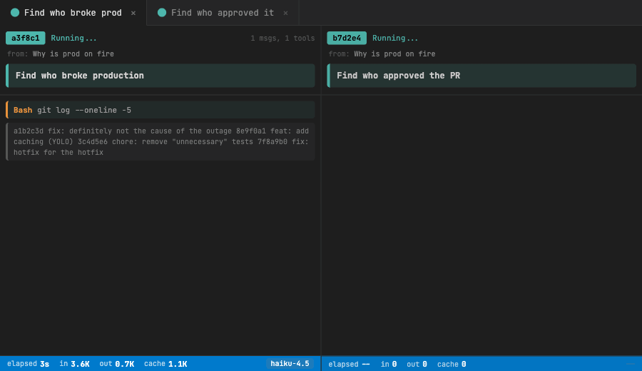

<p align="center">
  
</p>

<h1 align="center">Subs</h1>

<p align="center">
  <strong>Streaming panels for every AI coding sub-agent.</strong><br />
  Stop guessing what your agents are doing. Watch them work in real time.
</p>

<p align="center">
  <a href="LICENSE"></a>
</p>

---

When AI coding agents spawn parallel sub-agents, they work invisibly. You wait. You hope. You get a summary at the end.

**Subs cracks open the black box.** Every sub-agent gets its own real-time panel, streaming tool calls, reasoning, and results as they happen.

<p align="center">
  
</p>

## Quick Start

1. Install from the [VS Code Marketplace](https://marketplace.visualstudio.com/items?itemName=OmryHazak.subs) or run `ext install OmryHazak.subs`
2. Open an AI coding agent session in VS Code
3. When a sub-agent spawns, its panel appears automatically

That's it. No configuration needed.

## Features

- **Auto-detection** -- new sub-agent panels open instantly, no commands needed
- **Streaming output** -- tool calls, assistant text, and results appear in real time
- **Completion detection** -- done agents get a `[Done]` banner with the final result highlighted
- **Token stats** -- input/output tokens, cache hits, elapsed time, model name
- **Parent session** -- see which conversation spawned each sub-agent
- **Auto-scroll** -- follows output as it streams; freezes when you scroll up

## Install

Search for **Subs** in VS Code extensions, or:

```
ext install OmryHazak.subs
```

<details>
<summary>Install from source</summary>

```bash
git clone https://github.com/omryhazak/subs.git
ln -s "$(pwd)/subs" ~/.vscode/extensions/subs
```

Reload VS Code.

</details>

## Commands

| Command                | Description                         |
| ---------------------- | ----------------------------------- |
| `Subs: Start Watching` | Start (or restart) the file watcher |
| `Subs: Stop Watching`  | Stop watching and close all panels  |

The extension auto-starts on launch -- you shouldn't need these.

## How It Works

AI coding agents write sub-agent transcripts as JSONL files in a temp directory. Subs watches for new `.output` files, opens a webview panel for each one, and incrementally parses new bytes every 400ms. When no new data appears for 5 seconds, the agent is marked as done.

Up to 20 concurrent panels. All file I/O is async. Nonce-based CSP. No `innerHTML`.

## FAQ

<details>
<summary>Does it slow down VS Code?</summary>

No. File I/O is fully async and polling runs at 400ms intervals. Panels are capped at 20 concurrent. There is no measurable impact on editor performance.

</details>

<details>
<summary>Can I customize the panel layout?</summary>

Panels open as VS Code editor tabs. You can drag, split, and rearrange them like any other tab.

</details>

<details>
<summary>Does this extension collect any data?</summary>

No. Subs makes zero network requests and collects no telemetry. It only reads local JSONL files from your temp directory.

</details>

## Requirements

- VS Code 1.85+

## Contributing

Contributions are welcome! See [CONTRIBUTING.md](CONTRIBUTING.md) for guidelines.

## License

[MIT](LICENSE)
